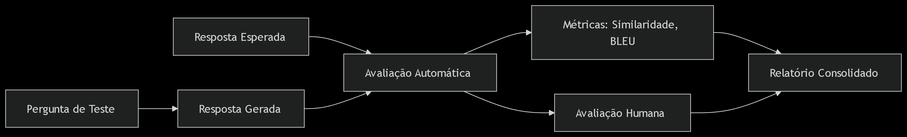

# TransforMind — BA Requirements Analyzer

Ferramenta de apoio a Business Analysts (BAs) para extração e classificação automática de requisitos de software a partir de documentos não estruturados (atas de reunião, PDFs, TXTs, DOCXs).

**Autor:** Regisson Aguiar  
**Versão:** 1.8

---

## Resultados

| Métrica | Resultado |
|---------|-----------|
| Classificador ML (SVM bilíngue, PROMISE NFR) | **87.8% accuracy** |
| Pipeline completo — Bancário (34 sentenças) | **97.1%** · F1=0.97 |
| Pipeline completo — Clínica Médica (27 sentenças, domínio novo) | **92.6%** · F1=0.94 |
| **Agregado multi-domínio (61 sentenças, 2 domínios)** | **95.1% · F1=0.96** |
| SVM supervisionado vs. Zero-Shot (Transformers) | **SVM: F1=0.96** / Zero-Shot: F1=0.65 |

---

## Visão Geral

O projeto partiu de um chatbot educacional sobre Transformação Digital e foi expandido para incorporar um pipeline de PLN capaz de:

- Receber documentos de especificação (PDF, TXT, DOCX)
- Extrair e classificar automaticamente requisitos por tipo
- Avaliar a qualidade individual de cada requisito (IEEE 830)
- Agrupar requisitos por tema com K-means semântico
- Detectar requisitos duplicados ou semanticamente similares
- Gerar User Stories a partir de requisitos funcionais
- Exportar os resultados para CSV e JSON

---

## Pipeline de PLN

```
ENTRADA: Arquivo PDF / TXT / DOCX
         │
         ▼
     Extração de Texto
     PyMuPDF (PDF) | python-docx (DOCX) | open() (TXT)
         │
         ▼
     Segmentação em Sentenças — NLTK sent_tokenize
         │
         ▼
     Para cada sentença:
         │
         ├──► Filtro Semântico (Sentence Transformers)
         │     Embedding + cosine similarity vs 960 âncoras PROMISE NFR
         │     threshold 0.455 (ou 0.35 se verbo de obrigação presente)
         │     score < threshold → DESCARTADO
         │
         └──► Passou o filtro → SpaCy en_core_web_sm (lematização + NER)
                         │
                         ├──► Regex PT+EN ──► Regra de Negócio?
                         │         SIM → classifica como business_rule
                         │
                         └──► NÃO → TF-IDF (1-2 grams, 5000 features)
                                         │
                                         ▼
                                     SVM — LinearSVC calibrado
                                     (treinado no PROMISE NFR bilíngue)
                                     predict_proba < 0.65 → uncertain
                                     → functional / non_functional / uncertain
         │
         ▼
     Resultados por tipo:
     🟢 Funcional | 🟡 Não-Funcional | 🔵 Regra de Negócio | ⚪ Incerto
         │
         ▼
     Score de Qualidade IEEE 830 (automático)
     → Excelente / Bom / Regular / Ruim / Inválido
         │
         ▼ (opcional)
     Agrupamento Temático — K-means semântico
     Detecção de Duplicatas — cosine similarity pairwise
     Geração de User Stories — Flan-T5-Base (local)
         │
         ▼
     Export CSV / JSON
```

---

## Funcionalidades

### Análise de Requisitos (BA Requirements Analyzer)

| Funcionalidade | Descrição |
|---------------|-----------|
| Upload de documentos | PDF, TXT, DOCX |
| Classificação automática | 🟢 Funcional · 🟡 Não-Funcional · 🔵 Regra de Negócio · ⚪ Incerto |
| Suporte bilíngue | PT e EN — tradução automática PT→EN na inferência |
| Filtro semântico | Rejeita narrativa, cabeçalhos e contexto organizacional |
| Score de qualidade IEEE 830 | 4 critérios: verbo de obrigação, mensurabilidade, ambiguidade, unicidade |
| Agrupamento temático | K-means semântico com rótulo automático por cluster |
| Detecção de duplicatas | Pares similares com threshold 0.82 |
| Geração de User Stories | Flan-T5-Base local, sem API externa |
| Export | CSV e JSON com tipo, qualidade, score, grupo e problemas |

### Chatbot de Transformação Digital

| Funcionalidade | Descrição |
|---------------|-----------|
| Resposta em linguagem natural | Busca semântica + TF-IDF sobre base de artigos |
| Classificação de intent | NB / LR / RF treinados em dataset próprio |
| Entrada por texto e áudio | Whisper (transcrição) + edge-tts (síntese) |
| Cache semântico | Reutiliza respostas para perguntas similares (95%+) |
| Persistência | Histórico de conversas no MongoDB Atlas |

---

## Dataset — PROMISE NFR

O classificador ML foi treinado no **PROMISE NFR Dataset**:

- **Total**: 969 requisitos em inglês → expandido para **1938 com tradução PT**
- **Labels**: `functional` (46%) / `non_functional` (54%)
- **Split**: 75% treino / 25% teste
- **Melhor modelo**: SVM (LinearSVC + CalibratedClassifierCV) — **87.8%**

---

## Como Executar

### 1. Clone e instale as dependências

```bash
git clone <URL_DO_SEU_REPO>
cd Chatbot_TransforMind
python -m venv venv
source venv/bin/activate  # Linux/macOS
pip install -r requirements.txt
```

### 2. Instale os modelos SpaCy

```bash
pip install https://github.com/explosion/spacy-models/releases/download/en_core_web_sm-3.8.0/en_core_web_sm-3.8.0-py3-none-any.whl
```

### 3. Configure o MongoDB Atlas

Crie um arquivo `.env` na raiz com:

```
MONGODB_URI=mongodb+srv://<usuario>:<senha>@<cluster>.mongodb.net/
```

### 4. Execute a aplicação

```bash
streamlit run src/main_chatbot.py
```

### 5. (Opcional) Retreine o classificador de requisitos

```bash
PYTHONPATH=src python src/helpers/train_requirements_classifier.py
```

Os modelos são salvos automaticamente em `model_train/model_train_requirements/version<N>/`.

---

## Estrutura do Projeto

```
Chatbot_TransforMind/
│
├── data/
│   ├── bilingual_requirements.csv       # PROMISE NFR EN + PT (1938 exemplos)
│   ├── pure_requirements.csv            # PROMISE NFR original EN (969 exemplos)
│   └── keywords_with_scores_and_intents.csv
│
├── documents/
│   ├── test_texto_corrido.txt           # Ata bancária — ground truth 34 sentenças
│   ├── test_ata_clinica.txt             # Ata clínica — ground truth 27 sentenças
│   ├── test_novo_documento.txt          # Documento de teste — RH
│   └── test_requisitos.txt             # Documento de teste — Pedidos
│
├── model_train/
│   ├── model_train_requirements/version6/   # Modelos ativos (SVM, NB, LR, RF, BiLSTM)
│   ├── model_train_intent/                  # Modelos de intent do chatbot
│   └── model_train_maturity_score/          # Modelos de maturidade digital
│
├── image/
│   ├── img_readme/                          # Imagens do README
│   └── model_train_requirements/matrices6/  # Matrizes de confusão (versão ativa)
│
├── src/
│   ├── main_chatbot.py                  # Interface Streamlit (entry point)
│   ├── main.py                          # CLI: extração, treino, pipeline
│   ├── evaluate_pipeline.py             # Avaliação formal com ground truth
│   ├── dao/connection_bd.py             # Conexão MongoDB Atlas
│   ├── helpers/
│   │   ├── requirements_extractor.py    # Pipeline principal de extração
│   │   ├── requirements_analyzer.py     # Qualidade IEEE 830, clustering, duplicatas
│   │   ├── train_requirements_classifier.py  # Treino dos modelos
│   │   ├── user_story_generator.py      # Geração de User Stories (Flan-T5)
│   │   ├── chatbot_interection.py       # Núcleo do chatbot TD
│   │   ├── extract_text.py              # Extração de texto (PDF, TXT, DOCX)
│   │   └── preprocess.py               # SpacyLemmaTokenizer + BiLSTM
│   ├── model/                           # Avaliação automática e humana
│   ├── resource/                        # Keywords, intent maps, configurações
│   └── utils/                           # Detecção de idioma, similaridade
│
├── output/                              # CSVs gerados pelo chatbot TD
├── log/                                 # Relatórios de classificação
├── input/                               # Artigos para extração de conhecimento
├── RELATORIO_PROJETO.md                 # Relatório técnico completo (v1.8)
├── RELATORIO_PROJETO.pdf                # PDF do relatório
└── requirements.txt
```

---

## Tecnologias

| Categoria | Tecnologia |
|-----------|-----------|
| Interface | Streamlit |
| Extração de texto | PyMuPDF, python-docx |
| Segmentação | NLTK sent_tokenize |
| PLN | SpaCy en_core_web_sm, TF-IDF (scikit-learn) |
| Classificador principal | LinearSVC + CalibratedClassifierCV (SVM) |
| Filtro semântico | all-MiniLM-L6-v2 (Sentence Transformers) |
| Detecção de idioma | langid |
| Tradução | deep-translator |
| Deep Learning | BiLSTM (PyTorch) |
| User Stories | Flan-T5-Base (HuggingFace, local) |
| Áudio | Whisper (STT) + edge-tts (TTS) |
| Persistência | MongoDB Atlas (pymongo) |
| Serialização | joblib |

---

## Fluxo de Avaliação



---

## Limitações Conhecidas

- **Discurso indireto**: requisitos embutidos em verbos de atribuição não cobertos (`lembrar`, `levantar`) não são detectados
- **Ambiguidade BR ↔ NF**: restrições de acesso a dados podem ser classificadas como Regra de Negócio em vez de Não-Funcional
- **User Stories**: Flan-T5-Base (250M params) gera histórias funcionais mas superficiais — sem critérios de aceitação elaborados
- **Ground truth**: 61 sentenças em 2 domínios — generalização para domínios muito específicos não garantida

---

## Autores

- **Regisson Aguiar** — rcpa@ecomp.poli.br
- **Maria Augusta**
- **Jessika Rufino**
